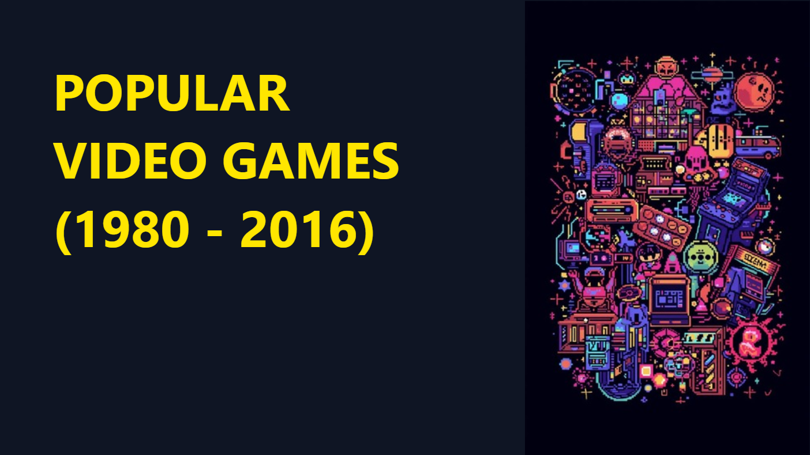
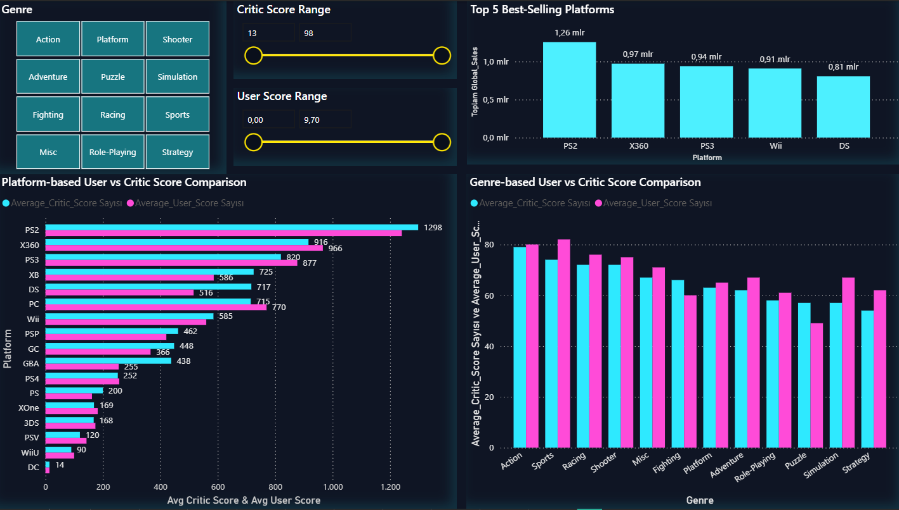
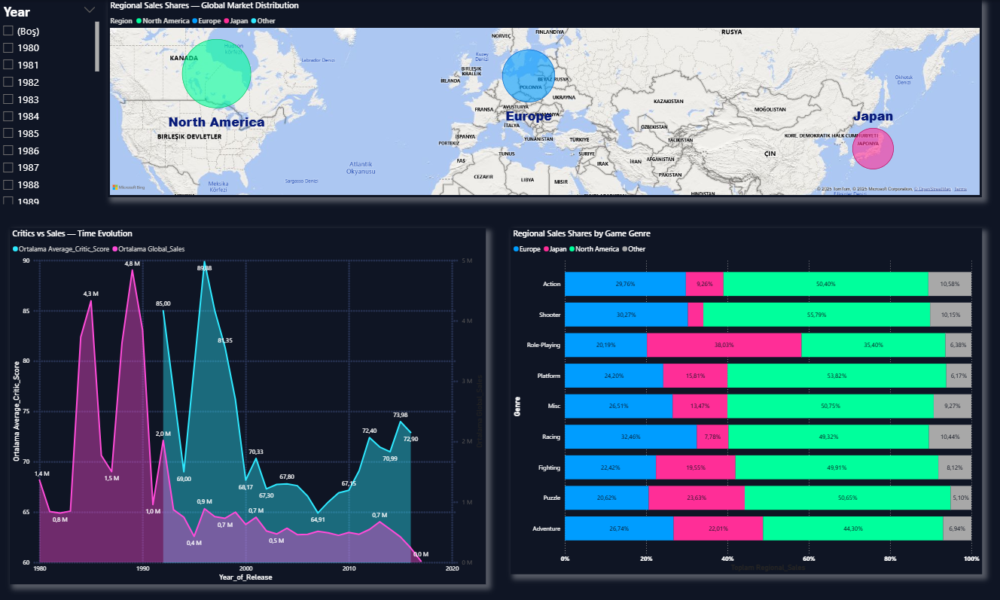
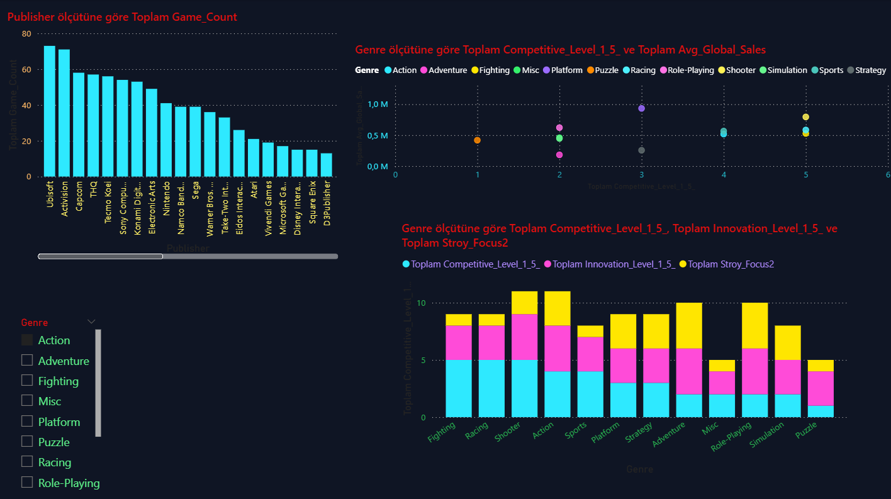

# 🎮 Video Game Sales Analytics & Prediction (1980–2016)

This project analyzes global video game sales between **1980 and 2016** and explores how
**genre, platform, region, player type and review scores** shape commercial success.
The main deliverable is an interactive **Power BI dashboard** plus a **machine learning model**
that predicts global sales (`Global_Sales`).

---

## 📊 1. Project Overview

- **Tools:** Power BI, Python (Random Forest), Excel / CSV
- **Dataset:** *Video Game Sales with Ratings* (Kaggle)  
- **Goal:**  
  - Understand how game characteristics (genre, platform, region, critic score, user score, etc.)
    affect sales
  - Compare **retro vs modern** eras, platforms and regions
  - Build a model that predicts a game’s **global sales potential**

---

## 🧾 2. Dataset

Original dataset:  
> Video Game Sales with Ratings – Kaggle  
> (sales by platform, region, critic/user scores, genres and publishers)

Key fields used:

- `Name`, `Platform`, `Genre`, `Publisher`, `Year_of_Release`
- `NA_Sales`, `EU_Sales`, `JP_Sales`, `Other_Sales`, `Global_Sales`
- `Critic_Score`, `User_Score`, `Critic_Count`, `User_Count`
- Engineered features such as **Era (Retro / Modern)**, **Console Generation**,  
  **Player_Type**, **Story_Focus**, **Innovation_Level**, **Multiplayer_Tendency**.

> The original CSV files are not included in this repo to keep it lightweight.  
> Please download the data directly from Kaggle if needed.

---

## 🖥️ 3. Dashboard Pages & Main Insights

### 3.1 Overview & KPIs
- High-level KPIs:
  - Number of genres, platforms and manufacturers
  - Average critic and user scores
- Slicers:
  - Release year range
  - Platform release year
  - Genre
- Visuals:
  - **Retro vs Modern Sales Share**
  - **Market Share by Manufacturer**

> Insight: Modern era dominates total sales, but a few retro platforms (PS2, X360, PS3, Wii)
still have very strong lifetime performance.



---

### 3.2 Critic vs User Score Analysis

- Score range slicers for **Critic_Score** and **User_Score**
- Comparison of **average critic vs user scores by platform and genre**
- Top-5 platforms by total global sales

> Insight: Platforms like **PS2, X360, PS3** combine high sales volumes with relatively strong scores,
indicating a good balance between commercial and critical success.



---

### 3.3 Regional Sales & Genre Preferences

- **Map view**: Global market distribution (North America, Europe, Japan, Other)
- **Stacked bar**: Regional sales shares by genre
- **Small multiples**: Evolution of genre preferences over time per region

> Insight:  
> - Japan is strongly biased towards **RPG** titles.  
> - Europe & North America show higher interest in **Shooter / Sports / Racing** games.  
> - Some genres perform consistently across all regions (e.g. Action).



---

### 3.4 Player Behaviour & Design Features

- Relationship between **Story_Focus**, **Innovation_Level**, **User_Score** and **game count**
- Impact of **Multiplayer_Tendency** on critic scores
- Player segments such as **Competitive, Skillful, Story-focused, Casual, Analytical**

> Insight: Higher **story focus** and **innovation** are associated with better user scores,
while multiplayer-oriented games tend to obtain slightly higher critic scores.


---

### 3.5 Competition, Innovation & Publisher Performance

- Top publishers by **number of games**
- Bubble/column charts:
  - Competitive level vs average global sales by genre
  - Competitive level, innovation and story focus aggregated by genre

> Insight: Certain genres (Shooter, Sports, Action) combine **high competition** with **high sales**.
For niche genres, strong innovation and narrative can compensate for lower competition.



---

### 3.6 Platform & Generation Performance

- **Sales by Platform** (lifetime global sales)
- **Average Sales by Console Generation**
- **Total Sales by Generation**
- **Release Window Analysis** (launch / mid / late lifecycle)

> Insight: Generations with highly successful platforms (e.g. PS2 era) create visible spikes in average sales.
Being strong at **console launch** provides significant sales advantage.


---

## 🤖 4. Machine Learning Model – Global Sales Prediction

A **Random Forest Regressor** was trained to predict `Global_Sales` using:

- `Average_Critic_Score`
- `Average_User_Score`
- `Genre`
- `Region`
- `Typical_Players` / `Player_Type`
- Additional engineered features (Era, Generation, etc.)

**Model Performance (example values):**

- MAE ≈ **422,000** units  
- R² ≈ **0.38**  
- Overall accuracy: **moderate** – useful for directional insights rather than exact forecasting.

**Feature Importance (Top Drivers):**

1. **Average_Critic_Score**
2. **Average_User_Score**
3. **Genre**
4. **Region**
5. **Typical_Players**

> Conclusion: Games with high critic and user scores, backed by the right genre–region
combination, have a clearly higher sales potential.


---

## ✅ 5. Key Takeaways & Recommendations

1. **Scores matter:** Critic and user ratings are the strongest predictors of sales.
   Investing in quality and polish is critical.
2. **Platform & generation choice is strategic:**  
   Successful generations (PS2, X360, PS3, Wii) significantly boost sales potential.
3. **Regional targeting is essential:**  
   Align game genre and marketing with regional tastes (e.g. RPG in Japan, Shooter/Sports in NA & EU).
4. **Modern era brings higher upside:**  
   Modern games have higher sales dispersion; hits can scale globally very fast.
5. **Design & player type:**  
   Story, innovation and competitive depth influence both perception and sales; the best-performing titles
   usually match the right **player type** profile for their target audience.


---

## 🗂 6. Repository Structure

```text
.
├── pbix/
│   └── video-game-sales-dashboard.pbix
├── images/
│   ├── 01_overview_dashboard.png
│   ├── 02_scores_dashboard.png
│   ├── 03_regional_dashboard.png
│   ├── 04_player_behavior_dashboard.png
│   ├── 05_competition_dashboard.png
│   ├── 06_platform_generation_dashboard.png
│   └── 07_model_dashboard.png
└── README.md
